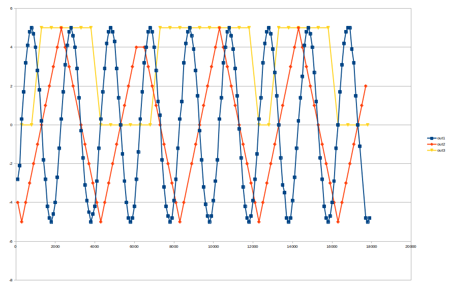

# udp-data-extract
Listen to UDP ports and parse data

## Requirements
Requires boost asio and boost json to be installed (boost v 1.75.0+)
Docker container is provided to build. Requirements are only build-time, not run-time.

## Build and run
*Build:*
```
cd /path/to/project
docker build -t udp-data-extract .
```

*Run:*
```
docker run -it --network="host" udp-data-extract
```

## Description
The app will launch a client `client1` and will listen on TCP ports 4001-4003. It will aggregate data into json and dump it to stdout every 100ms.

Design choices: Use boost asio for async reads at high performance, use boost json for json parsing, implements a steady clock that syncs with system time on boot, but will not jump if system time changes. It will slowly drift away from system time if left running for a long time. This choice is made to ensure exact time windows between reads.
Next read is scheduled based on last intended read time, so the processing time of the reads and outputs will not interfere with strict scheduling.


## Helpful Tools
Listen to TCP ports using python
```
python tools/log_tcp_stream.py -p <port>
```

Send udp commands
```
python tools/test_control_channel.py
```

# Solution

## Task 1
The tcp stream appears to be sending 3 signals:
`out1` is following a sign wave with a magnitude +-5.0 and a frequency of 0.5Hz or a cycle of 2 seconds.
`out2` is following a trinangle wave with the same magnitude and a frequency of 0.25Hz or a cycle of 4 seconds. This signal is producing data only every 200ms, but it is not synced so the exact publish frequency is not confirmed. 
`out3` is publishing a value of either 0.0 or 5.0. The output does not appear to be following a regular pattern.

A visualisation of the data can be seen below:



## Next
Task 2 should be relatively straightforward to implement as long as objects and values on the publishing service are easy to understand.

Many small improvements are still envisioned such as moving to optionals for `Client.last_data_` and possibly templating the client to accept inputs other than std::string.
Data parsing needs to be performed. Aggregate currently writes the data, but should instead make it available giving the user choice of what to do.

## Now for Task 2
Spamming the control channel and reading server logs appears to be the only way to get at properties.
Objects are `1,2,3` presumably corresponding to the different signals `"out1", "out2", "out3"`
Modifying our little python script to run through properties, then searching the log for `=` reveals the following properties exist:
```
1.14: enabled=1
1.170: amplitude=5000
1.255: frequency=500
1.300: glitch_chance=60
2.255: frequency=250
3.14: enabled=1
3.42: min_duration=1000
3.43: max_duration=5000
```

For our task that means setting the following properties:
When `out3` is `high` or above `3`
```
1.255:1000 // Frequency to 1Hz
1.170:8000 // Amplitude to 8000
```
When `out3` drops `low` or below `3`
```
1.255:2000 // Frequency to 2Hz
1.170:4000 // Amplitude to 4000
```
